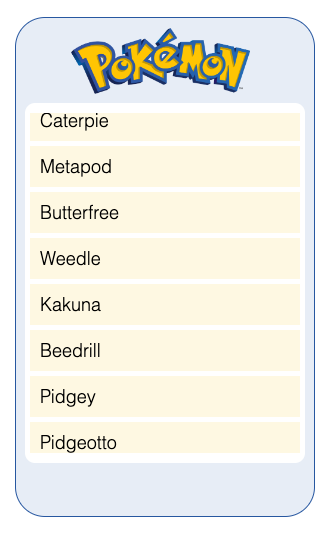

Pokedeck
=========	
Pokedeck is a Javascript app powered by the Pokemon API. It displays the info of the top 150 Pokemon characters.

MockUp
---------	
Mockup #2

Initial Mockup

Installation/Usage
---------	
No need to install, just [run the app from it's page](https://micolcodes.github.io/simple-js-app/)

Contributing
---------	
Pull requests are welcome. For major changes, please open an issue first to discuss what you would like to change.

Please make sure to update tests as appropriate.

License
---------	
[CC BY-NC](https://creativecommons.org/licenses/by-nc/4.0/)
